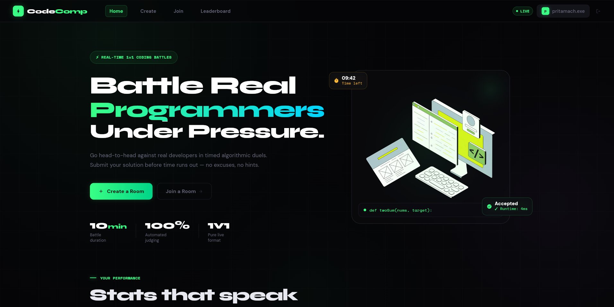

# ⚙️ CodeComp – Real-Time Competitive Coding Backend System ⚙️


---

A distributed, event-driven backend system for real-time 1v1 competitive coding, featuring room-based contests, asynchronous code execution, and live leaderboard updates.



Frontend Repository:  
https://github.com/IamPritamAcharya/CodeComp-Frontend

Deployed Site:  
https://codecompdev.netlify.app

---

## Overview

CodeComp is an event-driven backend system with distributed components, designed to manage real-time competitive programming contests at scale.

It handles authentication, room lifecycle management, asynchronous submission processing, real-time leaderboard updates, and contest history persistence.

The system leverages message queues and pub/sub mechanisms to decouple execution from request handling, ensuring low-latency APIs and scalable submission processing.

---

## Architecture

### High-Level Flow

Client → Spring Boot Backend → Distributed Components (PostgreSQL, Redis, RabbitMQ, Judge0)

### Detailed System Architecture

```text
                     +----------------------+
                     |      Client App      |
                     +----------+-----------+
                                |
                                | HTTPS / WebSocket
                                v
+--------------------------------------------------------------------+
|                    Spring Boot Backend                             |
|                                                                    |
|  +-------------------+    +-------------------+    +-----------+   |
|  | AuthController    |    | RoomController    |    | Security  |   |
|  | OAuth2 + JWT      |    | Rooms / Submit    |    | JWTFilter |   |
|  +---------+---------+    +---------+---------+    +-----+-----+   |
|            |                        |                      |       |
|            v                        v                      v       |
|     +-------------+        +------------------+     +---------+    |
|     | User Repo   |        | RoomService      |     | JwtUtil |    |
|     +-------------+        | ContestScheduler |     +---------+    |    
|                            +---------+--------+                    |
|                                      |                             |
|                                      v                             |
|                           +-------------------------+              |
|                           | SubmissionService       |              |
|                           | RateLimitService        |              |
|                           +-----------+-------------+              |
|                                       |                            |
|                  +--------------------+--------------------+       |
|                  |                                         |       |
|                  v                                         v       |
|         +--------------+                         +---------------+ |
|         | RabbitMQ     |                         | PostgreSQL    | |
|         | judge-queue  |                         | users, rooms  | |
|         | judge-dlq    |                         | submissions   | |
|         +------+-------+                         | problems      | |
|                |                                 | test_cases    | |
|                v                                 | history       | |
|           +---------------+                      +---------------+ |
|           | JudgeConsumer |                               ^        |
|           | calls         |                               |        |
|           | SubmissionSvc |                               |        |
|           +------+--------+                               |        |
|                  |                                        |        |
|                  v                                        |        |
|           +--------------+                                |        |
|           | Judge0 API   |--------------------------------+        |
|           +--------------+                                         |
|                  |                                                 |
|                  v                                                 |
|           +----------------+                                       |
|           | RedisPublisher |                                       |
|           | room:{roomId}  |                                       |
|           +------+---------+                                       |
|                  |                                                 |
|                  v                                                 |
|           +------------------------------+                         |
|           | RedisSubscriber              |                         |
|           | STOMP topic                  |                         |
|           | /topic/room/{roomId}         |                         |
|           +------------------------------+                         |
+--------------------------------------------------------------------+
```

### Component Breakdown

| Component       | Responsibility                                                |
| --------------- | ------------------------------------------------------------- |
| Spring Boot API | Core backend logic, authentication, room & contest management |
| PostgreSQL      | Source of truth for users, rooms, submissions, and history    |
| RabbitMQ        | Queue for asynchronous submission processing                  |
| Judge0          | Secure code execution engine                                  |
| Redis           | Pub/Sub for real-time event propagation                       |
| WebSockets      | Push live leaderboard & contest updates to clients            |

---

## Tech Stack

| Layer          | Technology          |
| -------------- | ------------------- |
| Backend        | Spring Boot         |
| Database       | PostgreSQL          |
| Cache / PubSub | Redis               |
| Queue          | RabbitMQ            |
| Code Execution | Judge0              |
| Realtime       | WebSockets (STOMP)  |
| Authentication | JWT + Google OAuth2 |
| Infrastructure | Docker              |

---

## System Design

### Event-Driven Architecture

The system follows an event-driven model where submission processing is decoupled from request handling using RabbitMQ. This ensures that API threads remain non-blocking while handling long-running code execution tasks.

### Real-time Updates

Room state changes are propagated using Redis Pub/Sub and delivered to clients via WebSockets, enabling low-latency updates without polling.

### Asynchronous Processing

Submissions are queued and processed by background consumers, improving scalability and preventing API bottlenecks under high load.

### Authentication Strategy

Google OAuth2 is used for identity verification, and JWT is issued for stateless authentication across all API requests.

### Consistency Model

* PostgreSQL acts as the source of truth
* Redis is used for event propagation, not persistence
* Clients receive eventually consistent updates via WebSockets

### Contest Model

* Room-based contests
* Two participants per room
* Scoring based on solved problems and penalty (time + attempts)

---

## Core Flows


### Login Flow

```text
User → Google OAuth → Backend → JWT issued → Client stores token
```

---

### Room Creation

```text
User → Create Room → Room stored with host + password
```

---

### Join Room

```text
User → Join with roomId + password → Added as participant
```

---

### Submission Flow

```text
User → Submit code → Stored (PENDING) → Sent to RabbitMQ →
Consumer → SubmissionService → Judge0 → Result evaluated → DB updated →
Redis publish → WebSocket push
```


### Contest End

* Manual: Host triggers end
* Automatic: Scheduler checks and ends contest

---

## Database Model

| Table                | Description                 |
| -------------------- | --------------------------- |
| users                | User data                   |
| rooms                | Contest rooms               |
| participants         | Users in rooms              |
| problems             | Problem definitions         |
| room_problems        | Problems assigned to rooms  |
| participant_problems | User-specific problem state |
| submissions          | Code submissions            |
| test_cases           | Input/output test cases     |
| contest_history      | Past contest results        |

---

## API Endpoints

### Authentication

| Method | Endpoint                     |
| ------ | ---------------------------- |
| `GET`    | /oauth2/authorization/google |
| `POST`   | /auth/login                  |
| `GET`    | /auth/oauth-success          |

---

### Rooms

| Method | Endpoint       |
| ------ | -------------- |
| `POST`  | /rooms/create  |
| `POST`   | /rooms/join    |
| `POST`   | /rooms/start   |
| `POST`   | /rooms/submit  |
| `POST`   | /rooms/end     |
| `GET`    | /rooms/stats   |
| `GET`    | /rooms/profile |

---

### Leaderboard & History

| Method | Endpoint                    |
| ------ | --------------------------- |
| `GET`    | /rooms/{roomId}/leaderboard |
| `GET`    | /users/{userId}/history     |

---

## Realtime Communication

| Type      | Endpoint             |
| --------- | -------------------- |
| `WebSocket` | /ws                  |
| `Topic`     | /topic/room/{roomId} |
| `Redis Pub` | room:{roomId}        |

---

## Running the Project

### Prerequisites

* Docker
* Docker Compose
* Java 21

### Steps


### 1. Build the project

```text
mvn clean package -DskipTests
```


### 2. Start services

```text
docker compose up --build
```


---

### Services

| Service     | Port  |
| ----------- | ----- |
| Backend     | 8081  |
| PostgreSQL  | 5432  |
| Redis       | 6379  |
| RabbitMQ    | 5672  |
| RabbitMQ UI | 15672 |
| Judge0      | 2358  |

---

## Environment Configuration

Example configuration:

spring.datasource.url=jdbc:postgresql://postgres:5432/codecomp
spring.datasource.username=postgres
spring.datasource.password=postgres

spring.data.redis.host=redis
spring.rabbitmq.host=rabbitmq

---

## Deployment

The system is designed for containerized deployment and can be hosted using platforms that support multi-service orchestration.

---

## Author

Pritam Acharya
